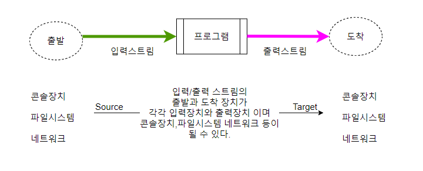

### 입출력

 + 컴퓨터 내부 또는 외부의 장치와 프로그램간의 데이터 전달(송신/수신)을 말하며,  스트림으로 구현됩니다.

 + stream(흐름) : 데이터 전송에 사용되는 연결 통로이며 단방향으로 통신합니다. 입력과 출력을 위해 2개의 스트림 사용하며 FIFO 구조(선입선출 구조) 입니다. java.io 패키지에서 클래스 제공. 

 + 입출력 데이터의 처리 단위에 따라 바이트 기반, 문자 기반 스트림으로 구분할 수 있다. 
 '바이트 기반 스트림'은 문자, 그림, 영상 등 이진 형식의 데이터를 처리하며, 
 '문자 기반 스트림'은 오직 문자 형식으로만 처리한다.

#### 1.바이트 기반 스트림

  __ InputStream 클래스의 메소드 __    

    abstract int read()
    int read(byte[] b)
    int read(byte[] b,int off,int len)
   
  __ OutputStream 클래스의 메소드 __   

    abstract void write(int b)
    void write(byte[] b)
    void write(byte[] b,int off,int len)
    flush() - 스트림 버퍼ㅇ의 모든 내용을 출력소스로 보낸다.

#### 2. 보조 스트림

 + 스트림의 기능을 보완하기 위한 기능을 제공합니다. 자체로는 입출력 수행을 하지 못하고 다른 스트림과 연결 되어 추가 기능을 갖는  스트림
 + 문자 변환, 입출력 성능 향상, 기본 데이터 타입 입출력, 객체 입출력 등의 기능을 제공합니다.

__ FilterInputStream/FilterOuputStream __
+ 다른 보조 스트림 클래스들의 상위 클래스  
	
__ BufferedInputStream/BufferedOuputStream __
+ 파일 읽기/쓰기에서 입력성능 향상을 위해 버퍼 제공
+ 입출력 소스와 직접 작업하지 않고 버퍼(buffer)와 작업 - 실행 성능 향상

__ DataInputStream/DataOuputStream __
+ 바이트 기반의 InputStream 으로부터 모든 표준 데이터 타입을 읽는 메소드를 제공 
+ 송신 프로그램과 수신 프로그램이 데이터 타입 메소드 실행 순서를 동일하게 해야합니다.

#### 3. 문자 기반 스트림

  __ Reader __
  
		+- InputStreamReader
			+ - FileReader
		+- CharArrayReader
	  
	 메소드    
	    	int read()
	    	int read(char[] cbuf)
	    	abstract int read(char[] cbuf,int off,int len)
  
  __ Writer __
  
		+- OutputStreamWriter
			+- FileWriter
		+- CharArrayWriter
			+- PrintWriter
			
	메소드    
    		void write(int c)
	    	void write(char[] cbuf)
	    	abstract void write(char[] cbuf,int off,int len)
	    	void write(String str)
	    	void write(String str,int off,int len)
	    
  __ 문자기반 보조스트림 __
  
	    	BufferReader/Writer
	    	FilterReader/Writer
	    	PrintWriter

#### 4. 객체 직렬화 스트림

 __ ObjectInputStream/OutputStream __ 

+ 객체 입출력 보조 스트림.객체를 파일 또는 네트워크로 입출력할 수 있는 기능 제공( 객체 직렬화)
+ 객체를 문자가 아닌 바이트 기반 스트림으로 변환하는 것으로  자바에서는 Serializable 인터페이스를 구현
+ 한 클래스만 직렬화 할 수   있다.  private 필드 포함한 모든 필드를 바이트로 변환 가능합니다.

